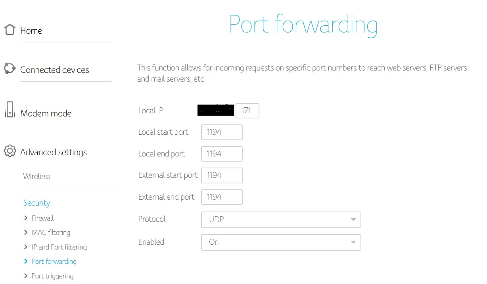
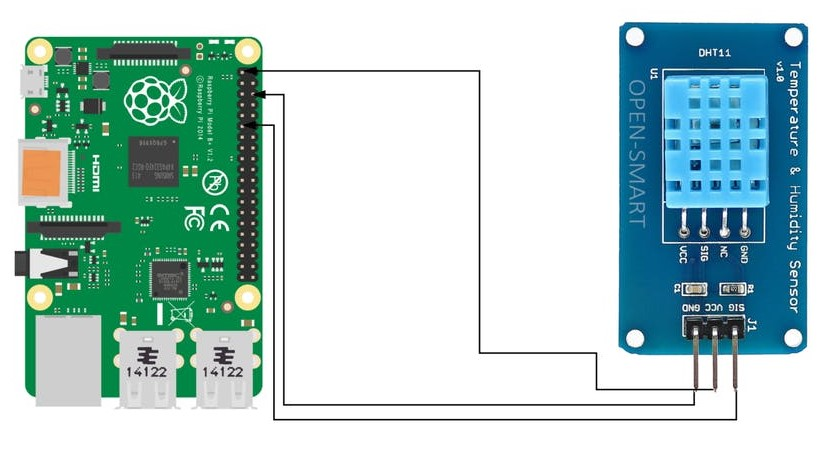
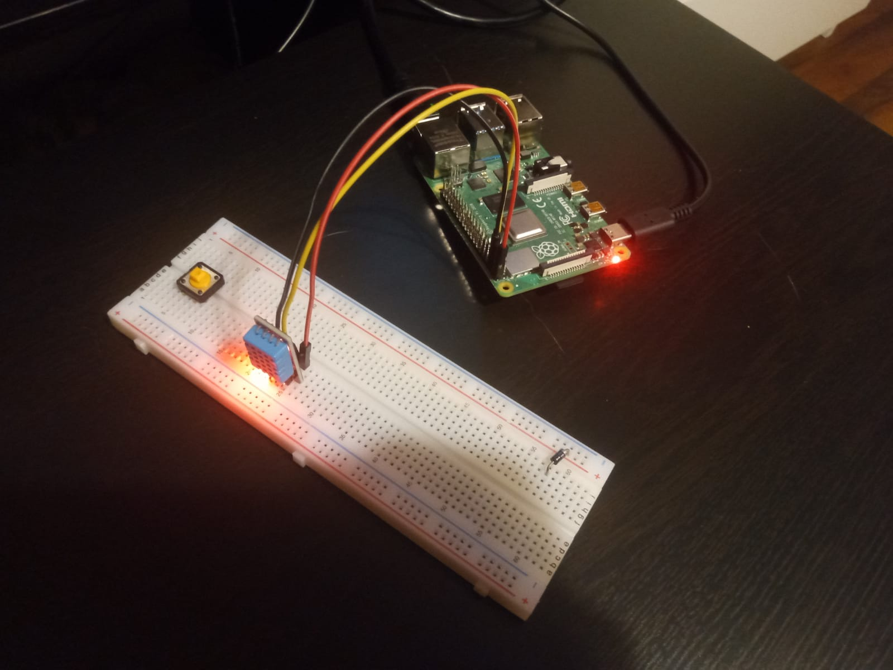
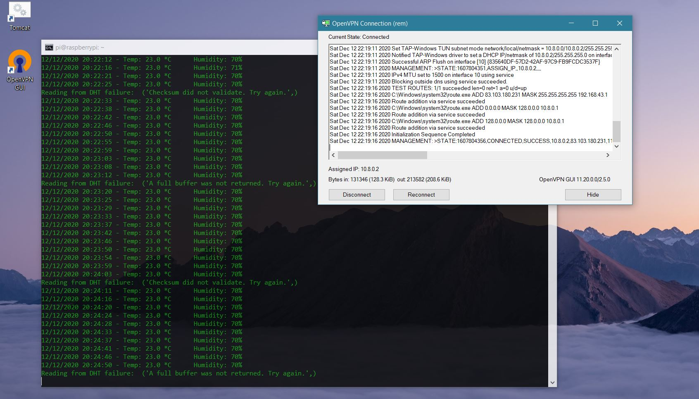

--- 
Disciplina: Arhitectura sistemelor de calcul
Data predare: 12.12.2020
---

# Monitorizarea remote a temperaturii si a umiditatii prin intermediul Raspberry Pi 4 si VPN

## Introducere

Proiectul isi propune citirea in timp real a informatiilor despre temperatura si umiditate furnizate de un senzor DHT11 conectat la Raspberry Pi 4. In plus informatiile vor fi transmise securizat catre un dispozitiv remote printr-o retea VPN in care rolul de server VPN este indeplinit de acelasi Raspberry Pi.   

## Materiale si metode

### a) Materiale
In realizarea proiectului au fost necesare componente hardware si software, detaliate in tabelele de mai jos.   
  
*Tabel 1*. Componente hardware utilizate

Nr.   | Dispozitiv                                | Comentarii
:--:  | ----------------------------------------- | -------------------------------------
1     | Raspberry Pi 4 Model B                    | varianta 8GB LPDDR4-3200 SDRAM
2     | Senzor de temperatura si umiditate DHT11  | varianta cu 3 pini si rezistenta inclusa
3     | Breadboard                                | pentru realizarea circuitului electric
4     | Cabluri pentru conexiuni                  | microHDMI-HDMI, circuit electric
5     | Dispozitiv cu rol de client VPN           | laptop / telefon mobil ...
6     | Card micro-SD                             | instalare sistem de operare, memorie non-volatila

*Tabel 2*. Componente software utilizate

Nr.   | Software                  | Comentarii
:--:  | ------------------------- | ------------------------------------------
1     | PiVPN                     | pentru a face Raspberry Pi server VPN
2     | OpenVPN                   | instalat pe dispozitivul cu rol de client VPN
3     | Windows cmd               | conectare la Raspberry Pi prin protocol SSH
4     | Visual Studio Code        | script Python, fisier documentatie Markdown
5     | Librarii / module Python  | detalii in text

Dispozitivul cu rol central in acest proiect este Raspberry Pi 4 Model B, ale carui specificatii complete sunt prezentate in *Figura 1*.

*Figura 1*. Specificatii tehnice Raspberry Pi 4 Model B (sursa: https://www.raspberrypi.org/products/raspberry-pi-4-model-b/specifications/?resellerType=home)

### b) Metode

Principalii pasi urmati pentru realizarea proiectului au fost:
* instalarea Raspian OS pe Raspberry Pi
* configurarea Raspberry Pi pentru a juca rolul de server VPN
* configurarea router-ului Wi-Fi al locuintei pentru a efectua port forwarding
* instalarea softului OpenVPN pe dispozitivul remote
* montarea circuitului electric pentru senzorul DHT11
* conectarea remote prin VPN si SSH la Raspberry Pi si rularea scriptului Python

Am optat pentru instalarea Raspian OS versiunea 32 biti cu GUI, urmand instructiunile de pe site-ul oficial al organizatiei Raspberry (https://projects.raspberrypi.org/en/projects/raspberry-pi-setting-up). Urmatorul pas consta in activarea SSH la nivelul Raspberry.  
  
Partea cea mai dificila este configurarea serverului VPN si consta in mai multe etape: 
* instalarea softului necesar pentru a transforma Raspberry Pi in server VPN: am utlizat PiVPN care poate fi rulat printr-o simpla comanda in terminal `curl -L https://install.pivpn.io | bash`
* configurarea serverului VPN cu urmatoarele setari:
    * setarea unei adrese IP statice pentru dispozitiv, pentru ca router-ul Wi-Fi al locuintei va fi configurat sa faca port forwarding catre Raspberry
    * setarea valorii portului OpenVPN (ex: 1194) prin care vor fi trimise pachetele de date de la router la Raspberry
    * configurarea criptarii ECDSA: 256 biti
    * selectarea intre IP public sau DNS pentru conectare la serverul VPN; pentru simplitate am optat pentru varianta IP public, dar aceasta are dezavantajul ca in cazul schimbarii adresei IP, proiectul nu va mai functiona si trebuie reconfigurat acest parametru
    * selectarea provider-ului DNS pentru clientii VPN: Google
    * restartare Raspberry Pi
    * crearea in terminal a unui profil de client ovpn `$ pivpn -a`, apoi adaugarea unui nume si a unei parole. Astfel se genereaza un fisier <nume_utilizator>.ovpn cu rol de certificat care trebuie transferat pe dispozitivele remote ce se vor conecta la serverul VPN si utilizat la realizarea conexiunii prin OpenVPN  

Pentru a redirectiona traficul de internet de la clientii VPN catre Raspberry Pi (serverul VPN), router-ul Wi-Fi al locuintei trebuie configurat in asa fel incat cererile primite prin protocolul HTTP la un anumit port (in cazul de fata, portul 1194) sa fie automat transmise catre IP-ul static al Raspberry Pi. In cazul meu router-ul Wi-Fi este un modem UPC. Pagina de port forwarding si setarile facute sunt prezentate in *Figura 2*.  

*Figura 2*. Setarile port forwarding pentru modem UPC. Campul *Local IP* reprezinta adresa de IP statica a Raspberry Pi  
  
In continuare am instalat softul OpenVPN (https://openvpn.net/download-open-vpn/) pe laptop-ul personal si am folosit fisierul de configurare <nume_utilizator>.ovpn mentionat mai sus pentru a certifica utilizatorul remote la serverul VPN. Acesta este un produs care poate fi utilizat gratuit.  
  
Circuitul electric necesar pentru citirea temperaturii si umiditatii este unul simplu (a se vedea *Figura 3*) si este alcatuit din: senzor DHT11 varianta cu 3 pini si rezistenta inclusa, 3 cabluri pentru conexiunile dintre GPIO Raspberry Pi si senzor (VCC, ground si data).   
Mai dificil este setup-ul software, mai precis descarcarea librariilor / modulelor necesare din cauza unor probleme de suport din partea principalului furnizor de drivere pentru senzorul DHT11, compania Adafruit: pip, `pip3 install adafruit-circuitpython-dht`, `sudo apt-get install libgpiod2`. Script-ul Python a fost compus si testat de mine dupa consultarea a multiple surse online, fiind dificil de compus o varianta corecta din cauzele mentionate mai sus.
  

*Figura 3*. Schema circuitului electric din proiect (sursa https://www.hackster.io/akmaneesha/raspberry-pi-based-iot-project-connecting-dht11-sensor-b27f2a)
  
Ultima etapa a constat in conectarea remote prin VPN si SSH la Raspberry Pi si rularea scriptului Python (care este inclus in folderul proiectului, la adresa "raspberrydht11.py").

## Rezultate

In ciuda intampinarii unor probleme legate de aplicatia OpenVPN (cateva crash-uri) si de situatia neclara a librariilor / modulelor Python care ofera suport pentru senzorul DHT11 si Raspberry Pi, am reusit sa obtin rezultatul dorit: citirea remote securizata a informatiilor despre temperatura si umiditate. Mentionez ca in cele din urma am optat pentru o conexiune ethernet intre modemul UPC si Raspberry Pi.  
In urmatoarele figuri sunt prezentate rezultatele proiectului.  

*Figura 4*. Componentele hardware ale proiectului, asamblate pentru citirea temperaturii si a umiditatii

*Figura 5*. Screenshot facut pe laptopul personal (aici cu rol de client VPN, deoarece este conectat la internet prin hotspot de pe telefonul mobil). In stanga este prezentat terminalul Windows cmd, conectat prin VPN, apoi SSH la Raspberry Pi si ruland script-ul Python (atasat) care contine instructiuni pentru citirea informatiilor furnizate de senzorul DHT11. In dreapta se observa fereastra OpenVPN care arata ca laptop-ul este conectat prin VPN la internet. 

### Ce am invatat?
Mentionez ca acest proiect mi-a oferit posibilitatea sa invat / aprofundez multiple notiuni despre:
* principiile generale de functionare ale internetului
* functionarea generala a retelei de internet locala
* configurarea router-ului UPC
* principiile de functionare ale VPN
* protocolul SSH, pe care nu il cunosteam anterior
* configurarea de baza a Raspberry Pi
* obiectiv secundar: am aprofundat cunostiintele pe care le aveam despre Markdown

## Concluzie

In ciuda faptului ca proiectul ales poate parea relativ simplu, acesta implica imbinarea a multiple notiuni de retelistica, electronica si programare care stau la baza unor constructii mult mai complexe. Proiectul a demonstrat citirea remote si securizata a unor senzori aflati in locuita, sau altfel spus, unul dintre principalele intrebuintari ale tehnologiilor IoT. Schema proiectului poate fi extinsa pentru multiple aplicatii, eventual care sa implice si efectuarea unor actiuni in functie de datele furnizate de senzori.

## Referinte
1. Tutorial Lon Seidman https://www.youtube.com/watch?v=15VjDVCISj0
2. PiVPN https://pivpn.io/
3. Site oficial Raspberry https://projects.raspberrypi.org/en
4. OpenVPN https://openvpn.net/
5. Librarii Python https://github.com/adafruit/Adafruit_CircuitPython_IRRemote
6. Instalare si utilizare librarii Python https://learn.adafruit.com/dht-humidity-sensing-on-raspberry-pi-with-gdocs-logging/python-setup
7. Playlist tutoriale video Raspberry Pi https://www.youtube.com/playlist?list=PLYl5sY0sL98hJRpne6ShX1I9JJ6MVIH4q
8. Ghid Markdown GitHub https://guides.github.com/features/mastering-markdown/
