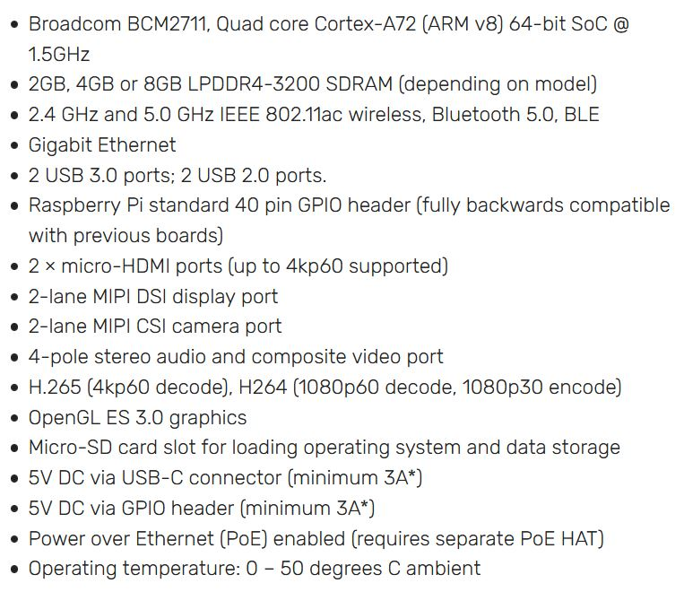

--- 
Disciplina: Arhitectura sistemelor de calcul
Data predare: 12.12.2020
---

# Monitorizarea temperaturii si a umiditatii prin itermediul VPN si Raspberry Pi 4

## Introducere

Proiectul isi propune citirea in timp real a informatiilor despre temperatura si umiditate furnizate de un senzor DHT11 conectat la Raspberry Pi 4. In plus informatiile vor fi transmise securizat catre un dispozitiv remote printr-o retea VPN in care rolul de server VPN este indeplinit de acelasi Raspberry Pi.   

## Materiale si metode

### a) Materiale
In realizarea proiectului au fost necesare componente hardware si software, detaliate in tabelele de mai jos.   
  
*Tabel 1*. Componente hardware utilizate

Nr.   | Dispozitiv                                | Comentarii
:--:  | ----------------------------------------- | -------------------------------------
1     | Raspberry Pi 4 Model B                    | varianta 8GB LPDDR4-3200 SDRAM
2     | Senzor de temperatura si umiditate DHT11  | varianta cu 3 pini si rezistenta inclusa
3     | Breadboard                                | pentru realizarea circuitului electric
4     | Cabluri pentru conexiuni                  | microHDMI-HDMI, circuit electric
5     | Dispozitiv cu rol de client VPN           | laptop / telefon mobil ...
6     | Card micro-SD                             | instalare sistem de operare, memorie non-volatila

*Tabel 2*. Componente software utilizate

Nr.   | Software                  | Comentarii
:--:  | ------------------------- | ------------------------------------------
1     | PiVPN                     | pentru a face Raspberry Pi server VPN
2     | OpenVPN                   | instalat pe dispozitivul cu rol de client VPN
3     | Windows cmd               | conectare la Raspberry Pi prin protocol SSH
4     | Visual Studio Code        | script Python, fisier documentatie Markdown

Dispozitivul cu rol central in acest proiect este Raspberry Pi 4 Model B, ale carui specificatii complete sunt prezentate in *Figura 1*.

*Figura 1*. Specificatii tehnice Raspberry Pi 4 Model B (sursa: https://www.raspberrypi.org/products/raspberry-pi-4-model-b/specifications/?resellerType=home)

### b) Metode

Principalii pasi urmati pentru realizarea proiectului au fost:
* instalarea Raspian OS pe Raspberry Pi
* configurarea Raspberry Pi pentru a juca rolul de server VPN
* montarea circuitului electric pentru senzorul DHT11
* conectarea remote prin VPN si SSH la Raspberry Pi si rularea scriptului Python

Am optat pentru instalarea Raspian OS versiunea 32 biti cu GUI, urmand instructiunile de pe site-ul oficial al organizatiei Raspberry (https://projects.raspberrypi.org/en/projects/raspberry-pi-setting-up). Urmatorul pas consta in activarea SSH la nivelul Raspberry.
Partea cea mai dificila este configurarea serverului VPN si consta in mai multe etape: 
* instalarea softului necesar pentru a transforma Raspberry Pi in server VPN: am utlizat PiVPN care poate fi rulat printr-o simpla comanda in terminal `curl -L https://install.pivpn.io | bash`
* configurarea serverului cu urmatoarele setari: 
  

## Rezultate

### Ce am invatat

## Concluzie

## Referinte
1. Tutorial Lon Seidman https://www.youtube.com/watch?v=15VjDVCISj0
2. PiVPN https://pivpn.io/
